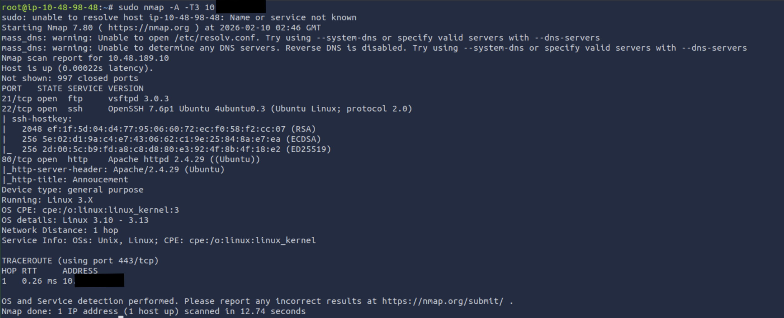
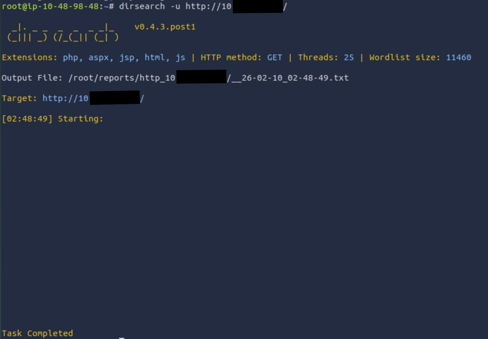
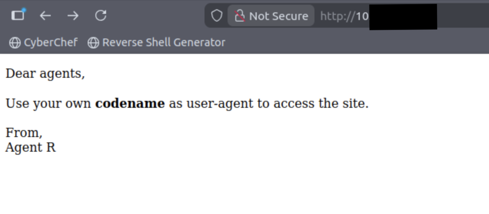
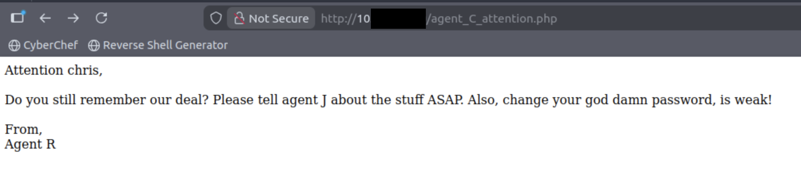

# Agent Sudo Writeup 

## Enumerate

### Assume the target IP address is `10.x.x.x`.

#### How many open ports?

Using nmap, it can be identified the number of ports that are opened for the target:

It displays all the info about the target and uses a fast intensity speed to accelerate the scan.

Therefore, there are 3 open ports, which is port 21 (FTP), 22 (SSH), and 80 (HTTP).

#### How you redirect yourself to a secret page?

At the first time, I look up into dirsearch to search for hidden pages for the target that has open HTTP service. 

After scanning it, here are the results:

However, based on the results given above, it does not return any results, which means it has no hidden directories.

Then, looking into the webpage of the target, here provides a number of interesting features:

Here, it provides the result to use the `codename` user-agent to access the site.

Since I got stuck, I used the hint and it says the format is: xxxx-xxxxx.

Notice something familiar? User-agent is matched with the format of the answer. So, the answer is User-Agent, to utilise the site.

#### What is the agent name?

Here, I have no idea what to do. So, I looked up the hint from TryHackMe. It says that:

`You might face problem on using Firefox. Try 'user agent switcher' plugin with user agent: C`

It requires the user to switch user agents to access the site, as mentioned in the site. 

So, after performing what is written at the hint above, the site produces this results:

It uses a codename to be able to view the content of the other user. 

Here, we retrieve the username of the agent, which is chris. So, we got the username called Chris. 
