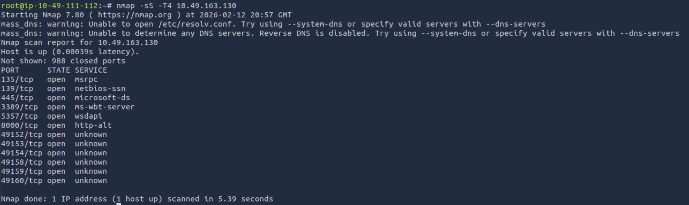
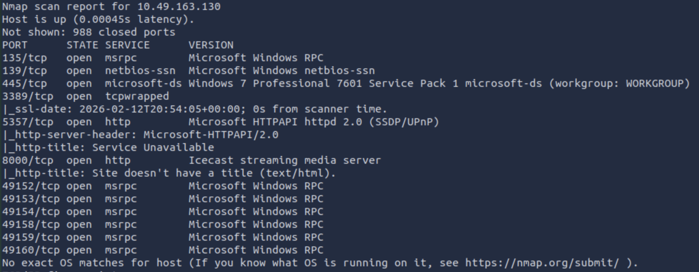
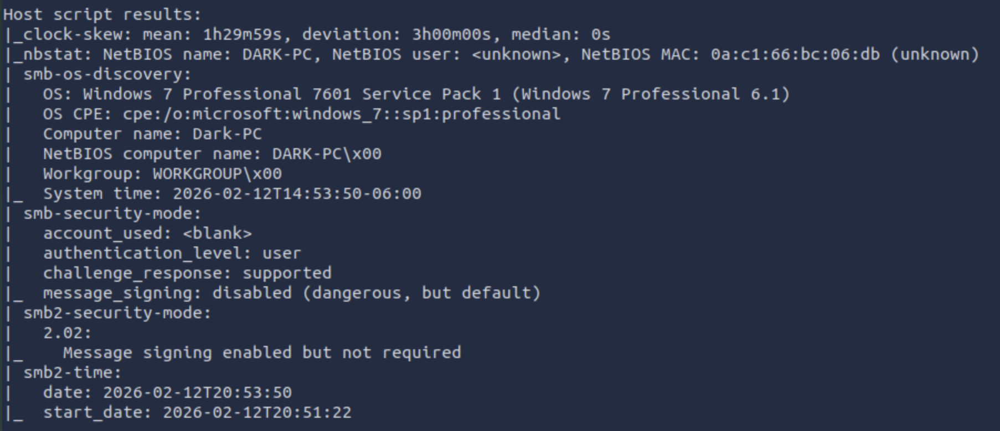

# ICE - Write up

## Recon

#### Launch a scan against our target machine, I recommend using a SYN scan set to scan all ports on the machine.

Here, we utilise the `nmap` command that allows it to perform a SYN scan. The command:

` nmap -sS -T4 <IP> `

Here are the results:

To receive more information about the target, add `-A` to the command. So, the full command is:

` nmap -sS -A -T4 <IP> `

#### Once the scan completes, we'll see a number of interesting ports open on this machine. As you might have guessed, the firewall has been disabled (with the service completely shutdown), leaving very little to protect this machine. One of the more interesting ports that is open is Microsoft Remote Desktop (MSRDP). What port is this open on?

As we see on the first SYN scan, it contains information about the open ports and the description of the port. 

Based on the question, since it was asking about Microsoft Remote Desktop (MSRDP), it is verified that port 3389 is the port. 

`ms-wbt` stands for Microsoft Windows Based Terminal.

#### What service did nmap identify as running on port 8000? (First word of this service)

On the image located above for the complete scan, it identifies the name of the port, open port, and its service.

Since port 8000 is listed, it is clear that this port is using Icecast.

#### What does Nmap identify as the hostname of the machine? (All caps for the answer)

Nmap identifies the hostname as Dark-PC, which is given from the complete nmap scan performed on the second image.

Here is the result of the host script that performed using nmap:

