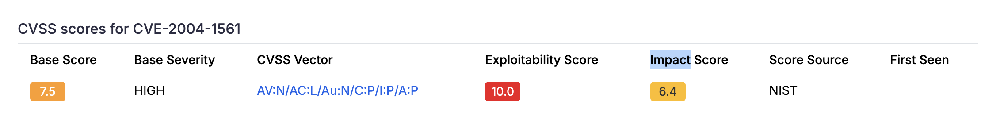
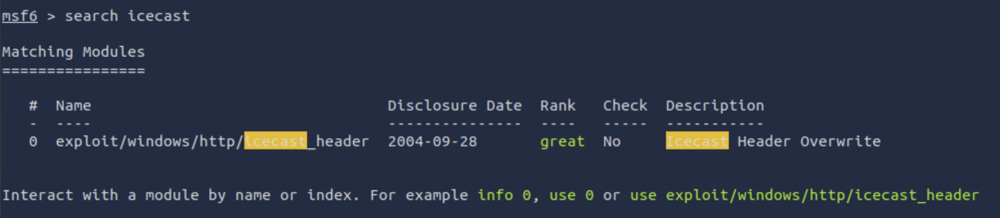
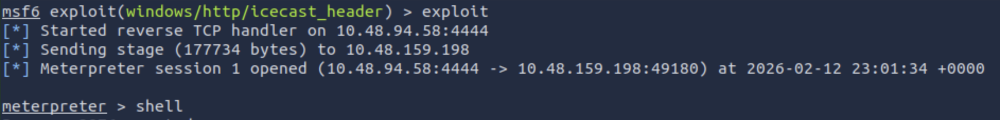
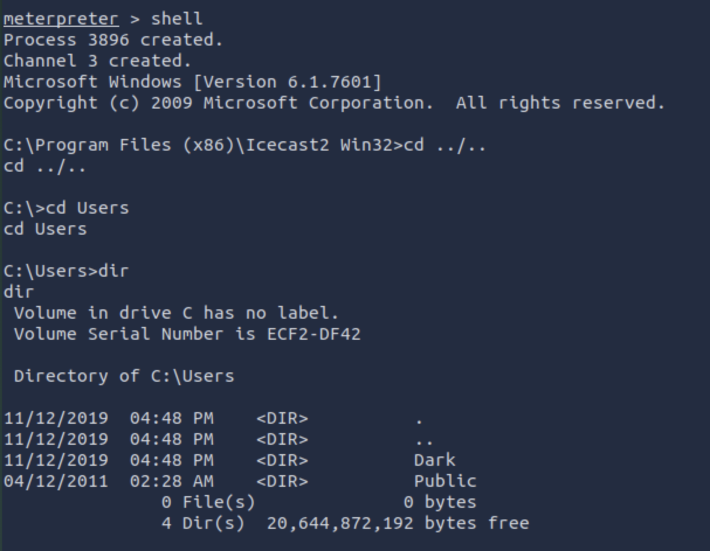
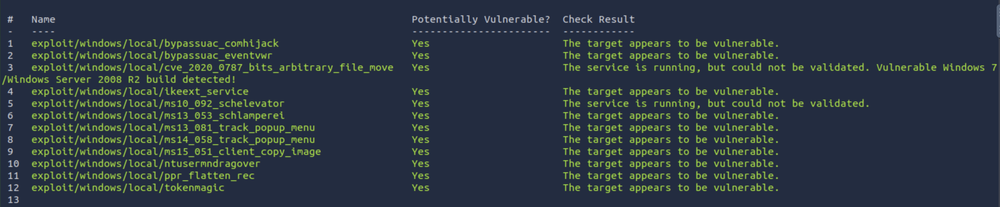
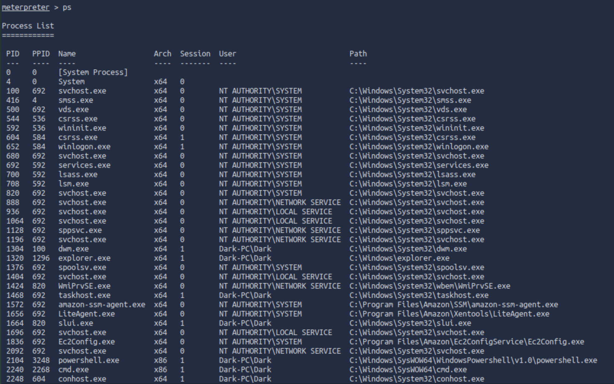
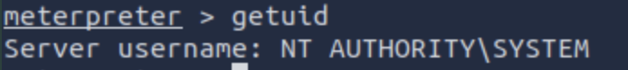
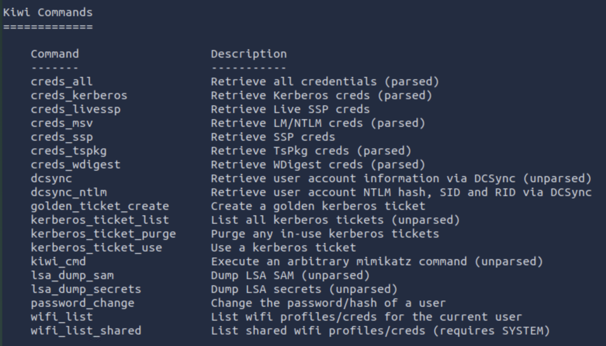
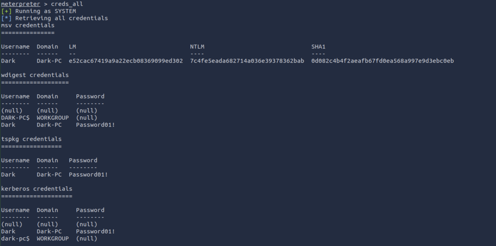

# ICE - Write up

[Room Link](https://tryhackme.com/room/ice)

## Recon

#### Launch a scan against our target machine, I recommend using a SYN scan set to scan all ports on the machine.

Here, we utilise the `nmap` command that allows it to perform a SYN scan. The command:

` nmap -sS -T4 <IP> `

Here are the results:

To receive more information about the target, add `-A` to the command. So, the full command is:

` nmap -sS -A -T4 <IP> `

#### Once the scan completes, we'll see a number of interesting ports open on this machine. As you might have guessed, the firewall has been disabled (with the service completely shutdown), leaving very little to protect this machine. One of the more interesting ports that is open is Microsoft Remote Desktop (MSRDP). What port is this open on?

As we see on the first SYN scan, it contains information about the open ports and the description of the port. 

Based on the question, since it was asking about Microsoft Remote Desktop (MSRDP), it is verified that port 3389 is the port. 

`ms-wbt` stands for Microsoft Windows Based Terminal.

#### What service did nmap identify as running on port 8000? (First word of this service)

On the image located above for the complete scan, it identifies the name of the port, open port, and its service.

Since port 8000 is listed, it is clear that this port is using Icecast.

#### What does Nmap identify as the hostname of the machine? (All caps for the answer)

Nmap identifies the hostname as Dark-PC, which is given from the complete nmap scan performed on the second image.

Here is the result of the host script that performed using nmap:

## Gain Access

#### Now that we've identified some interesting services running on our target machine, let's do a little bit of research into one of the weirder services identified: Icecast. Icecast, or well at least this version running on our target, is heavily flawed and has a high level vulnerability with a score of 7.5 (7.4 depending on where you view it). What is the Impact Score for this vulnerability? Use [this link](https://www.cvedetails.com/cve/CVE-2004-1561/) for this question and the next.

The information of the impact was given in the form of table, which is given on this website:

#### What is the CVE number for this vulnerability? 

The CVE number was given in the image above or by opening the link of the previous question.

#### After Metasploit has started, let's search for our target exploit using the command 'search icecast'. What is the full path (starting with exploit) for the exploitation module?

Before obtaining the path, `msfconsole` needs to be started first. So, based on that situation, run msfconsole and then perform a search for icecast module command: `search icecast`. We obtain this results:

Now, to run the exploit, the module needs to be used first. It is achievable by running `use <exploitModule>`.

## Escalate

#### Woohoo! We've gained a foothold into our victim machine! What's the name of the shell we have now?

After using the exploit module, it is essential to check the options available. The command `show options` is pivotal to set up the exploit.

Once the exploit has been setup, run the exploit by using `run` or `exploit` command, which gives the results below:

#### What user was running that Icecast process?

Run the shell inside the meterpreter and go to the `C:\Users` directory. The users are all listed over there.

#### What build of Windows is the system?

It can be obtained by running the sysinfo command provided by metasploit in the meterpreter. 

Results:

#### Now that we know some of the finer details of the system we are working with, let's start escalating our privileges. First, what is the architecture of the process we're running?

On the image given above, where it has the information about the system, displays the architecture of the target system.

#### Running the local exploit suggester will return quite a few results for potential escalation exploits. What is the full path (starting with exploit/) for the first returned exploit?

The task suggested the user to run the module called `post/multi/recon/local_exploit_suggester` in the meterpreter. 

The results are shown below in this image:

Since the second exploit provides more information about the system itself, the answer would be the second one provided on the list listed in the image.

#### We can now verify that we have expanded permissions using the command `getprivs`. What permission listed allows us to take ownership of files? (In the module on the previous question)

The meterpreter session needs to background and change the module of the exploit in the previous module by using the command `use <exploit>`. 

Then, the command `show options` provides the information about the parameters that needs to be set, in this case the session.

After everything is setup, the exploit can be performed by utilising running `run` or `exploit` to obtain the new meterpreter session and run the cmd `getprivs`.

Results of privileges:

## Looting

#### In order to interact with lsass we need to be 'living in' a process that is the same architecture as the lsass service (x64 in the case of this machine) and a process that has the same permissions as lsass. The printer spool service happens to meet our needs perfectly for this and it'll restart if we crash it! What's the name of the printer service?

This can be achieved by running the command `ps` in the meterpreter, which the results will be shown below:

#### Let's check what user we are now with the command `getuid`. What user is listed?

The `getuid` means to get the username of the server. 

#### What is Dark's password?

First, we need to load the module called kiwi (mimikatz) to the meterpreter using `load kiwi`. The help command should display the kiwi commands now. 

After that, we retrieve the credentials of the username by running `creds_all` command to retrieve the username and password of the system, with the result shown below:

## Post-Exploit

This questions are all on the help page in meterpreter.

#### What command allows us to dump all of the password hashes stored on the system? We won't crack the Administrative password in this case as it's pretty strong (this is intentional to avoid password spraying attempts)

hashdump

#### While more useful when interacting with a machine being used, what command allows us to watch the remote user's desktop in real time?

screenshare

#### How about if we wanted to record from a microphone attached to the system?

record_mic

#### To complicate forensics efforts we can modify timestamps of files on the system. What command allows us to do this? Don't ever do this on a pentest unless you're explicitly allowed to do so! This is not beneficial to the defending team as they try to breakdown the events of the pentest after the fact.

timestomp

#### Mimikatz allows us to create what's called a `golden ticket`, allowing us to authenticate anywhere with ease. What command allows us to do this?

golden_ticket_create
