# Carnage - THM Write-up

## Executive Overview:

This write-up is to document my thought process throughout the challenge and develop my ability to utilise a networking GUI (Graphical User Interface) tool called Wireshark. 

## Tools used:

1. Wireshark
2. Virustotal

## Problems and Thought Process

### What was the date and time for the first HTTP connection to the malicious IP?

For the date, it is mentioned on the statistics panel that the first captured packet date. 

Navigate to `Statistics > Capture File Properties` for the Date. 

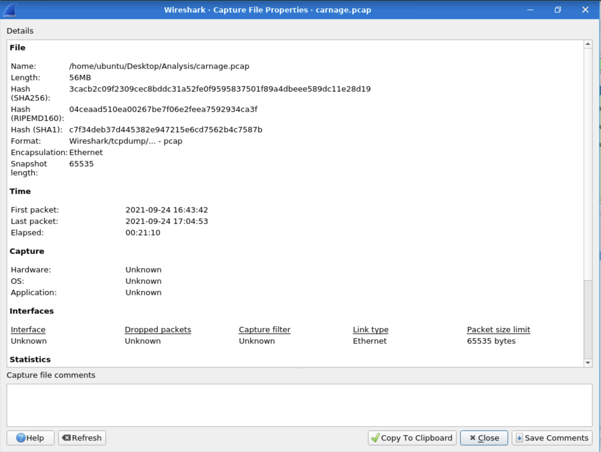

For the time, it is filtered using the filter bar on the Wireshark GUI. 

How to view the time: `Right click on Time Column > Column Preferences > Double click on the type with the time column > Change to UTC time`.

OR

Calculate the seconds after the first packet is recorded, which will be given in the image below:

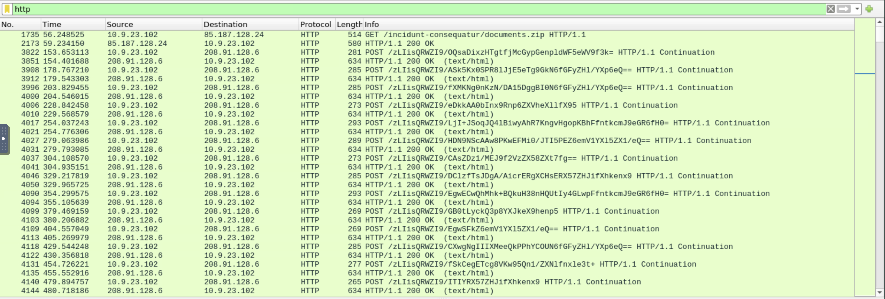

Answer on Time: The first packet recorded + Seconds displayed on the image above.

Therefore, the answer will be in Date followed with time in UTC.

### What is the name of the zip file that was downloaded?

The previous image shows that the name of the zip file that was downloaded named `documents.zip`, in the first packet.

### What was the domain hosting the malicious zip file?

The domain is located on the packet details of the previous question, where it shows the full request URI. 

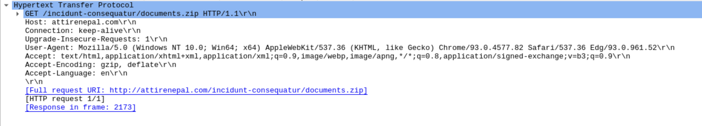

### Without downloading the file, what is the name of the file in the zip file?

Looking at the packet bytes of the previous question, there is an excel file inside the zip file. 

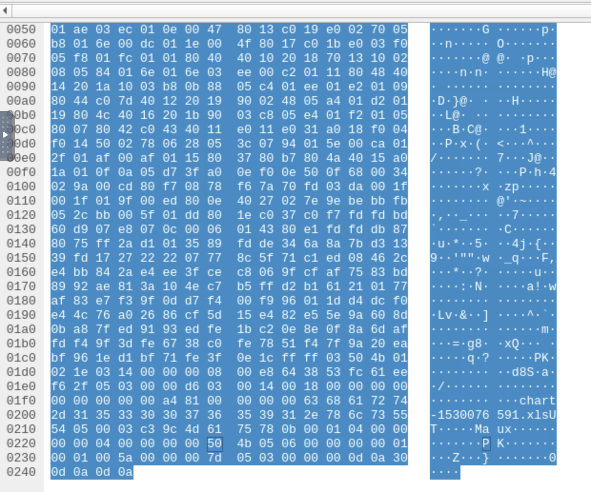

### What is the name of the webserver of the malicious IP from which the zip file was downloaded?

The name of the webserver is located at the second packet, which is located after the request of the zip file.

It provides the name of the web server inside the packet frame. 

### What is the version of the webserver from the previous question?

This question asks for the software used and the version that the web is using. 

Different from the previous question where it asks the name of the webserver used. 

The answer can be found on the image below:

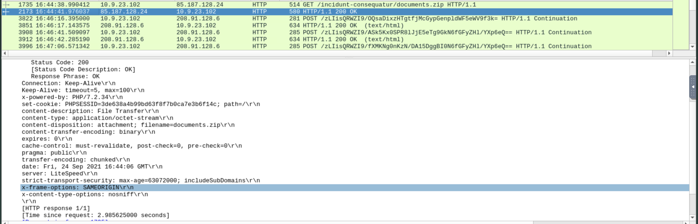

<!-- This also has the answer of the previous question! -->

### Malicious files were downloaded to the victim host from multiple domains. What were the three domains involved with this activity?

Hmm, this one is a little bit interesting. 

So, the question asks if there are malicious files that were downloaded in multiple **domains**. So, the location of the answer would be in the DNS filter. 

If we filter `dns` in the Wireshark filter bar and scroll down a little bit, we found the answer of this question. 

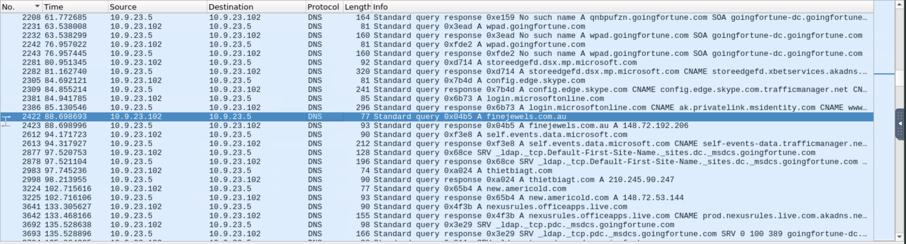

The answer of the image because of the threat actor that gathered multiple sites to the target so that it has the ability to deface the target computer.

Here is the source of the attack:

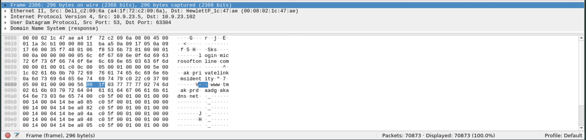

### Which certificate authority issued the SSL certificate to the first domain from the previous question?

It is located on the encryption process, where the Transport Layer Security (TLS) takes place in the first domain.

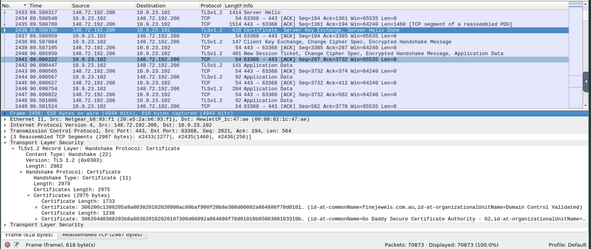

### What are the two IP addresses of the Cobalt Strike servers? Use VirusTotal (the Community tab) to confirm if IPs are identified as Cobalt Strike C2 servers. (answer format: enter the IP addresses in sequential order)

I felt the struggle when I did not understand the word Cobalt Strike servers. Here, I need to look up the hint by TryHackMe. 

<!-- Hint: Check the Conversations menu option -->

Here, the hint suggests that I need to look in the conversation menu, so I look there and filter based on the packets descending, which is shown in the image given:

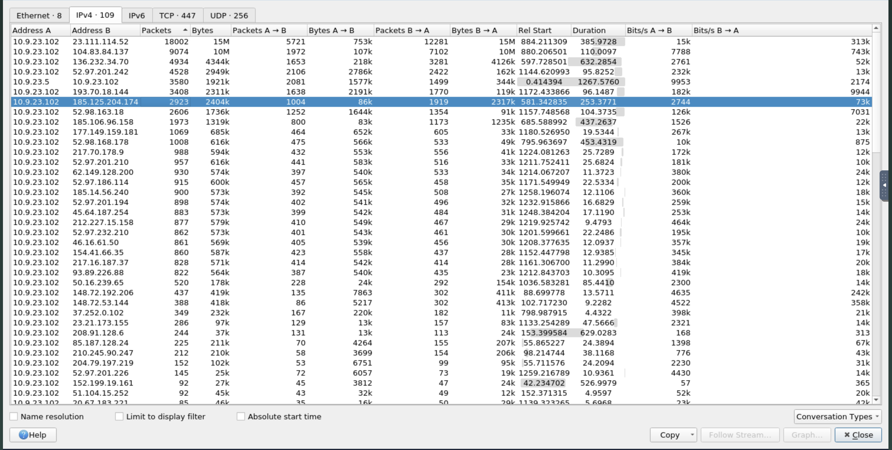

Based on the format of the answer, there are 2 top IP addresses that are match. We can verify by looking at the results in VirusTotal and check the comments on the image given below:

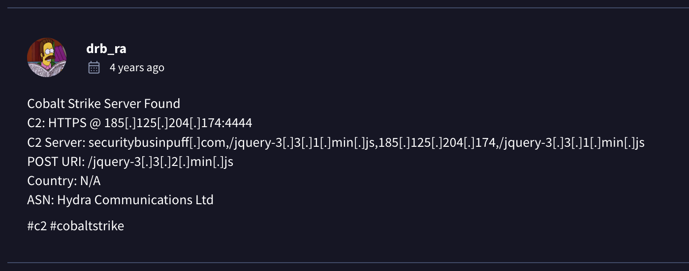

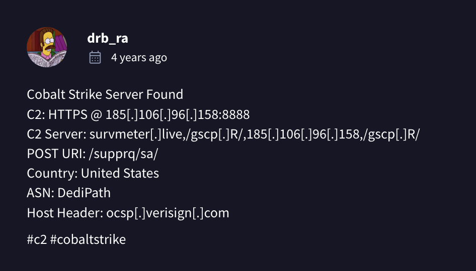

### What is the Host header for the first Cobalt Strike IP address from the previous question?

If we filter using the first IP address of the previous answer, then the results are shown below:

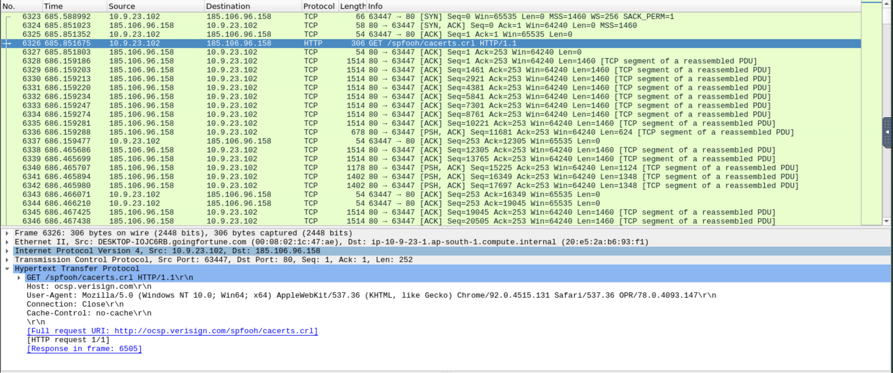

The host header is written on the packet details.

### What is the domain name for the first IP address of the Cobalt Strike server? You may use VirusTotal to confirm if it's the Cobalt Strike server (check the Community tab).

Answer is located on the previous 2 questions, on the comment given. 

### What is the domain name of the second Cobalt Strike server IP?  You may use VirusTotal to confirm if it's the Cobalt Strike server (check the Community tab).

Answer is the same as the previous question.

### What is the domain name of the post-infection traffic?

This is also the question that I got confused with, where I cannot find the domain of the post-infection traffic. 

The hint of TryHackMe written as follows:

` filter the post HTTP traffic`

Based on what I gain, it filters the traffic after the HTTP traffic, which has no relationship with HTTP. 

After finding through multiple packets, I read the hint again carefully. I realised that this answer is located on the POST method of the HTTP traffic.

Therefore, we need to filter the wireshark packets by using the filter bar: `http.request.method == "POST"`.

Here are the results and the answer is located on the packet bytes:

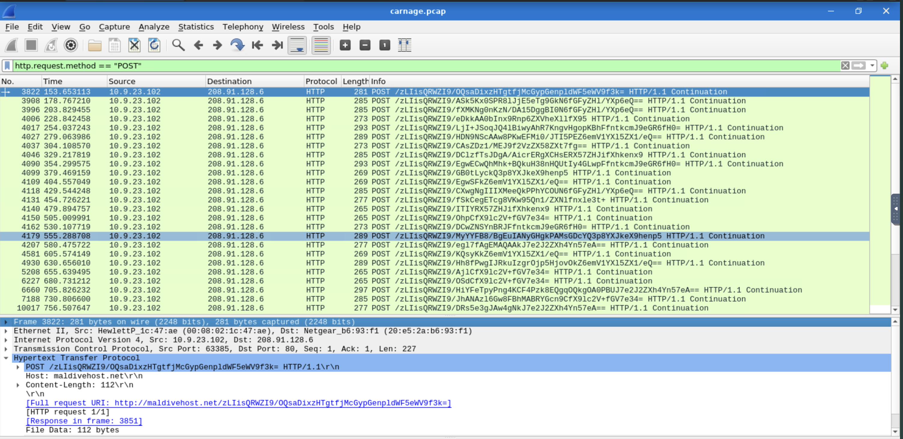

### What are the first eleven characters that the victim host sends out to the malicious domain involved in the post-infection traffic?

The filter that needs to be applied for this question: http.host == `"maldivehost.net"`. Here is the result in the image format:

### What was the length for the first packet sent out to the C2 server?

The answer will be on the same packet that is in the previous 2 questions where the post-infection traffic domain is located at the first time.

### What was the Server header for the malicious domain from the previous question?

It provides one of the packet details results as well with the answer, with the filter on the previous 2 questions:

### The malware used an API to check for the IP address of the victim’s machine. What was the date and time when the DNS query for the IP check domain occurred? (answer format: yyyy-mm-dd hh:mm:ss UTC)

We need to know the domain name of the API first. Head to the next question to find out the name, otherwise continue reading.

So, if we apply the DNS filter in the filter bar: `dns.qry.name == "api.ipify.org"`, then we yield this resources:

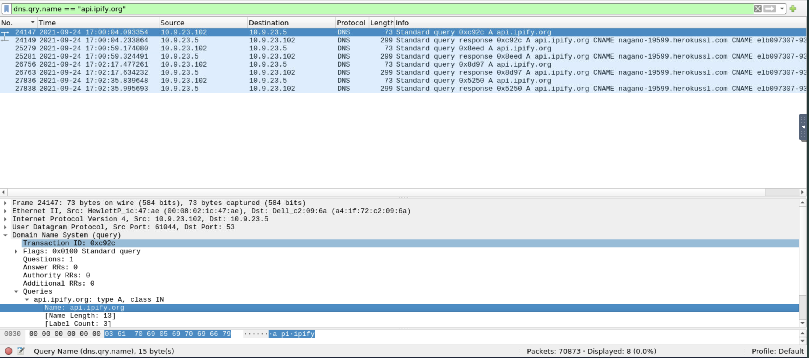

### What was the domain in the DNS query from the previous question?

So, the DNS query of the previous question is located after the HTTP traffic. The frame number needs to be filtered to produce the results in the image below:

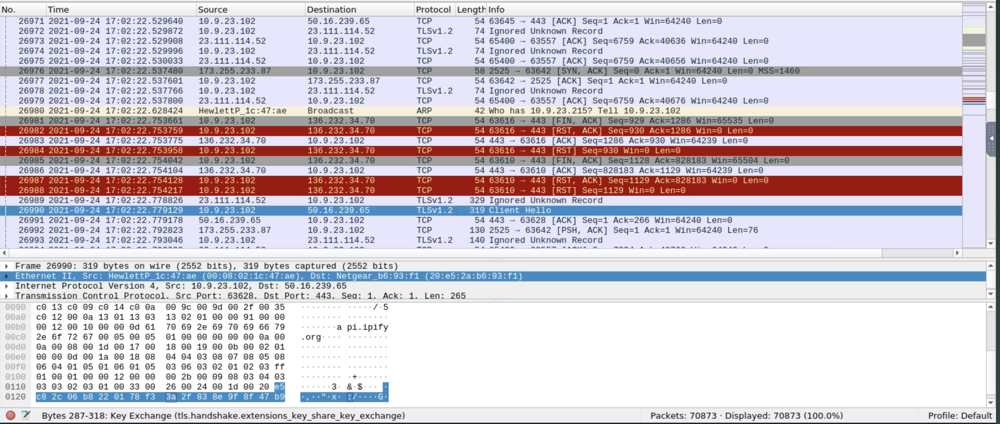

### Looks like there was some malicious spam (malspam) activity going on. What was the first MAIL FROM address observed in the traffic?

It seems that the question is talking about mail traffic, so it is verified that the filter that is suitable for this question is the `smtp` that needs to be applied in the filter bar. 

Therefore, here is the result of the filter:

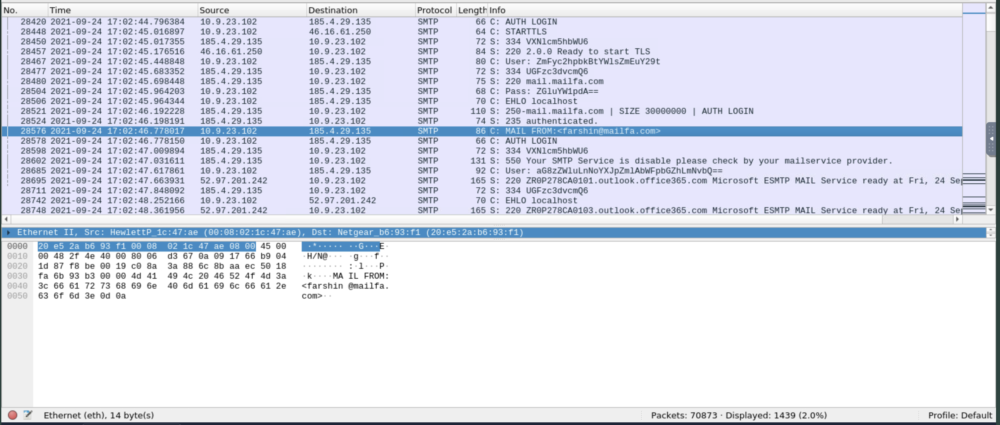

### How many packets were observed for the SMTP traffic? 

Based on the answer given on the previous question, the image has the answer located at the bottom right of it.

<!-- Answer is more than 1000! -->

# Conclusion

To conclude, this write up discusses the answers and thought processes in the challenge room. 

Tip: Make sure to read the question carefully and think before you try to answer the question.
